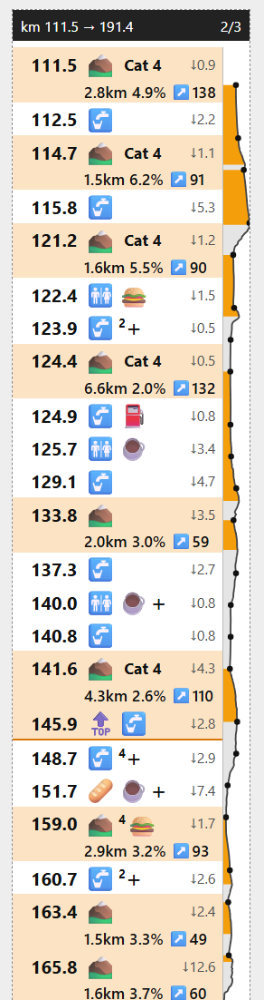

# roadbook

`roadbook` turns a GPX route with points of interest (water, food, toilets, …) into a compact road book you can print.
You cut the strips out and tape them to your bike's top tube. Each one lists the stops, climbs and distances for a stretch of the ride, next to a small elevation profile.



*A strip from [`samples/entrainement_ubf.gpx`](samples/entrainement_ubf.gpx), shown here at about twice its printed size. On paper it is 35 mm wide.*

## Getting a GPX with POIs

The easiest source is [onroutemap.de](https://onroutemap.de). It is free and needs no account. Upload your route's GPX ("Upload GPX file") and set the maximum distance to the route. It then finds supermarkets, bakeries, cafés, drinking water, toilets, fuel stations, fast food and more along the way. Use the download button (top left of the map) and choose the export with **the route and every discovered POI**, as GPX. Both files in [`samples/`](samples/) were made this way.

Any other GPX works if it has:

- **a track or a route**, ideally with elevation (without elevation you get no climbs and no profile);
- **waypoints** for the POIs, each with a `<type>` or a `<name>` that one of the categories in [`src/roadbook/default.toml`](src/roadbook/default.toml) can match. For example, a type `Boulangerie` or `bakery` becomes 🥖, and `Eau potable` or `drinking water` becomes 🚰. Matching ignores case and accents. Waypoints that match no category are dropped.

## Install

You need:

- [uv](https://docs.astral.sh/uv/), which installs Python and the dependencies for you;
- Google Chrome or Microsoft Edge, only if you want `--pdf`.

Then:

```sh
git clone https://github.com/bnogaro/gpx2roadbook.git
cd gpx2roadbook
uv sync
```

## Usage

```sh
uv run roadbook my_ride.gpx
```

This writes `my_ride.roadbook.html` next to the GPX and prints a short summary: distance, climbing, and how many POIs, stops and climbs were found. To write it somewhere else, use `-o`:

```sh
uv run roadbook my_ride.gpx -o ~/Desktop/ride.html
```

### Printing

Open the HTML in your browser and print it. Print at **100 % scale**, not "fit to page", so the strips keep their real size in millimetres. If the coloured rows come out white, turn on "background graphics".

Or let `roadbook` make the PDF for you. It drives Chrome or Edge in the background and writes `my_ride.roadbook.pdf` next to the HTML:

```sh
uv run roadbook my_ride.gpx --pdf
```

Either way, cut along the dashed lines.

### Layouts

- **`--layout strip`** (default): vertical strips, 35 mm wide and 200 mm long, read top to bottom. One row per stop or climb, with an elevation profile down the right edge. Made for the top tube.
- **`--layout line`**: horizontal ribbons, 16 mm high, read left to right. One small block per stop or climb, with short climb stats and no profile. Use it when a 35 mm strip is too wide for where you want to tape it.

### Common options

| Option | What it does |
| --- | --- |
| `--width MM`, `--length MM` | Size of each strip: the short side (default 35 for `strip`, 16 for `line`) and the long side (default 200). |
| `--page A4` | Paper size, e.g. `A4`, `A5`, `Letter`. |
| `--checkpoint-every KM` | Add a checkpoint row every N km (🚩 `CP1 · 120 to go`). |
| `--checkpoint KM:LABEL` | Add one checkpoint, e.g. `--checkpoint 87.5:Lunch`. Repeat it for more. |
| `--categories water,bakery,toilets` | Keep only these POI categories. The names are the `[categories.*]` sections of `default.toml`. |
| `--max-offset M` | Ignore POIs further than this many metres from the route (default 300). |
| `--min-climb M` | Only count ascents gaining at least this many metres as climbs (default 80). Lower it to see smaller rises. |
| `--gap M` | Merge POIs closer than this many metres into one stop (default 500). |
| `--max-span M` | The longest a stop may stretch, in metres (default 3 × `--gap`). Longer runs of POIs are split into several stops, never between POIs at the same spot. |
| `--leg-elevation` | Add a line under each row with the distance, climbing and descent to the next row. |
| `--no-details` | Leave out the reference sheet with the POI names. |
| `--config my.toml` | Override any setting, see below. |

For the full list:

```sh
uv run roadbook --help
```

## Customising

Every setting lives in [`src/roadbook/default.toml`](src/roadbook/default.toml). Don't edit it. Write a small TOML file with only the keys you want to change and pass it with `--config`. It is merged over the defaults, table by table.

For example, to show hotels and campsites, snap stops onto climbs from further away, and widen the profile:

```toml
# my.toml
[pois]
# a list replaces the default list entirely, so repeat the categories you want to keep
enabled = ["water", "toilets", "bakery", "cafe", "food", "grocery", "lodging"]

[climbs]
snap_m = 500      # default 300

[render]
gutter_mm = 6     # default 4; 0 turns the profile off
```

```sh
uv run roadbook my_ride.gpx --config my.toml
```

To add a category of your own, add a table and put its name in `pois.enabled`. The order of the tables sets which emoji comes first when a row is short of space:

```toml
[categories.bike]
emoji = "🔧"
match = ["bicycle", "velo", "cycle shop"]
```

## How to read the road book

Each strip has a dark header with its km range and its number (`2/3`). Below that, one row per point on the road:

- **The bold number** is the km where the row sits. **`↓4.3`** at the right is the distance to the next row. With `--leg-elevation`, that distance moves to a line under the row, along with the climbing and descent to the next row.
- **🟢 START, 🏁 FINISH, 🚩 CP…** are the start, the finish and checkpoints, on a blue background.
- **Emojis** are the POIs at that stop. A small number after one (🚰²) says how many POIs of that kind are there. A **`+`** means more kinds are there than fit on the row. They are all listed on the reference sheet.
- **`→129.1`** under a stop means its POIs stretch from the row's km to km 129.1. Stops longer than 1 km (`render.stop_range_m`) show this, which mostly happens with a large `--gap`.
- **⛰️ rows** (orange) mark the foot of a climb. The line below gives its length, average grade and ↗️ total gain, e.g. `4.3km 2.6% ↗️110`. **`Cat 4`** … **`Cat HC`** is its category, scored as length × grade, the same way as the Tour de France. Small climbs have no category. Ascents gaining less than 80 m (`--min-climb`) are not shown as climbs at all.
- **Stops on a climb.** A stop within 300 m (`climbs.snap_m`) of a climb's foot or summit is merged into that row rather than given a row of its own. A ⛰️ row with a stop on it has no room for "Cat 4", so the category becomes a small superscript on the mountain (⛰️⁴ 🍔).
- **🔝 rows** mark a summit. They only appear when a stop sits at the top; the profile already shows every other summit. If there is room, the row also gives the summit's elevation. A 🔝 row closes its climb with an orange line.

### The profile on the right

The narrow strip on the right edge of each strip is the elevation profile of that stretch. Elevation grows to the right.

- **Orange** shading is a climb. **Grey** is everything else.
- **Each dot** lines up with a row, so you can see where each stop is on the profile.
- **Distance on the profile is not to scale.** The profile is stretched to fit between the rows, so a 10 km gap between two rows takes the same space as a 1 km gap. Use it to see the shape of the climbs, not to measure distance.
- **Elevation is scaled for each strip separately.** A big slope on one strip is not the same height as a big slope on the next. Very flat stretches are kept flat, so small rolls don't look like mountains.

### The reference sheet

After the strips comes a page listing every stop by km (as a range, e.g. `km 122.4 → 129.1`, for long stops), with the name of each POI grouped by emoji. When a POI is more than 30 m off the route, its distance from the route is shown in brackets, e.g. `Intermarché Super (265 m)`. Keep it in a pocket, or leave it out with `--no-details`.

## Development

```sh
uv run pytest          # run the tests
uv run prek install    # check commit messages (Conventional Commits) before each commit
```
